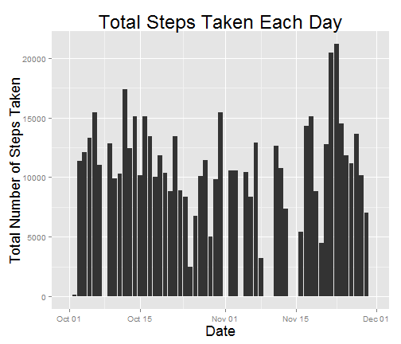
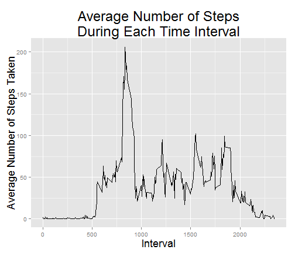
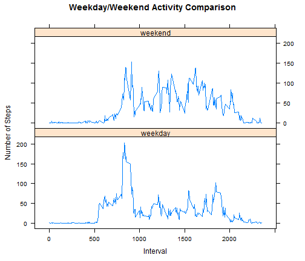

# Reproducible Research: Peer Assessment 1
This is an R Markdown document for Reproducible Research Peer Assessment #1.

## Loading and preprocessing the data

1. Import "activity.csv" and assign to data table **activity**
2. Ensure that second column is imported as class = date

```r
require(data.table)
```

```
## Loading required package: data.table
```

```r

activity <- as.data.table(read.csv("activity.csv", header = T, colClasses = c("numeric", 
    "Date", "numeric")))
```


## What is mean total number of steps taken per day?

Calculate total number of steps taken each day:

```r
tSteps <- activity[, list(totalSteps = sum(steps, na.rm = TRUE)), by = date]
```


Plot histogram of the total number of steps taken each day

```r
require(ggplot2)
```

```
## Loading required package: ggplot2
```

```r
## Create barplot
p1 <- ggplot(data = tSteps, aes(x = date, y = totalSteps))
p1 <- p1 + geom_bar(stat = "identity")

## add axis labels
p1 <- p1 + labs(title = "Total Steps Taken Each Day", x = "Date", y = "Total Number of Steps Taken")
## Change Title Font
p1 <- p1 + theme(plot.title = element_text(size = rel(2)))

## Change Axis Label Font
p1 <- p1 + theme(axis.title = element_text(size = rel(1.5)))

## Display plot
print(p1)
```

 


Calculate and report mean and median total number of steps taken each day:

```r
summarySteps <- matrix(c(mean(tSteps$totalSteps, na.rm = TRUE), median(tSteps$totalSteps, 
    na.rm = TRUE)), ncol = 2)

colnames(summarySteps) <- c("Mean_Steps/Day", "Median_Steps/Day")
row.names(summarySteps) <- c("")

# print mean and median as table
as.table(summarySteps)
```

```
##  Mean_Steps/Day Median_Steps/Day
##            9354            10395
```


## What is the average daily activity pattern?

Calculate average number of steps taken in every 5 minute interval across all days

```r
intSteps <- activity[, list(intSteps = mean(steps, na.rm = TRUE)), by = interval]
```


Plot a time series plot of the average number of steps taken, averaged across all days, vs. 5-minute intervals

```r
p2 <- ggplot(data = intSteps, aes(x = interval, y = intSteps))
p2 <- p2 + geom_line()

## add axis labels
p2 <- p2 + labs(title = "Average Number of Steps\nDuring Each Time Interval", 
    x = "Interval", y = "Average Number of Steps Taken")

## Change Title Font
p2 <- p2 + theme(plot.title = element_text(size = rel(2)))

## Change Axis Label Font
p2 <- p2 + theme(axis.title = element_text(size = rel(1.5)))

## Display plot
print(p2)
```

 


Find and report which 5-minute interval, on average across all the days in the dataset, contains the maximum number of steps?

```r
paste("Maximum averager number of steps occured in interval:", intSteps$interval[which.max(intSteps$intSteps)])
```

```
## [1] "Maximum averager number of steps occured in interval: 835"
```


## Imputing missing values

Calculate and report the total number of missing values in the dataset (i.e. the total number of rows with NAs):

```r
sum(!complete.cases(activity))
```

```
## [1] 2304
```


We will use mean value for a given time interval across all days to fill missing values.
Create a new dataset **activity.filled** with replaced missing values according to strategy above.
Please note that warning messages echo will be suppressed:

```r
setkey(activity, interval)
activity.filled <- activity[is.na(activity$steps) == "TRUE", `:=`(steps, intSteps$intSteps), 
    by = interval]
```


Calculate total number of steps taken each day using filled data:

```r
tSteps.filled <- activity.filled[, list(totalSteps = sum(steps, na.rm = TRUE)), 
    by = date]
```


Plot histogram of total number of steps taken each day

```r
require(ggplot2)
## Create barplot
p3 <- ggplot(data = tSteps.filled, aes(x = date, y = totalSteps))
p3 <- p3 + geom_bar(stat = "identity")

## add axis labels
p3 <- p3 + labs(title = "Total Steps Taken Each Day", x = "Date", y = "Total Number of Steps Taken")
## Change Title Font
p3 <- p3 + theme(plot.title = element_text(size = rel(2)))

## Change Axis Label Font
p3 <- p3 + theme(axis.title = element_text(size = rel(1.5)))

## Display plot
print(p3)
```

 


Calculate and report mean and median number of steps taken each day using filled activity table:

```r
summarySteps.filled <- matrix(c(mean(tSteps.filled$totalSteps, na.rm = TRUE), 
    median(tSteps.filled$totalSteps, na.rm = TRUE)), ncol = 2)

colnames(summarySteps.filled) <- c("Mean_Steps/Day", "Median_Steps/Day")
row.names(summarySteps.filled) <- c("")

# print mean and median as table
as.table(summarySteps.filled)
```

```
##  Mean_Steps/Day Median_Steps/Day
##            9382            10395
```


Because we used mean number of steps per interval to fill the missing values, the mean number of steps did not change, however, the median did.

Since we filled missing step values with average values per interval the new estimate of the total number of daily steps is larger than using orginal data with missing values.


## Are there differences in activity patterns between weekdays and weekends?

Create a new factor variable, *w_e*, in the dataset with two levels -- "weekday" and "weekend" indicating whether a given date is a weekday or weekend day

```r
## Create a new variable weekDay indicating day of the week
activity.filled[, `:=`(weekDay, weekdays(date))]
```

```
##          steps       date interval   weekDay
##     1:  1.7170 2012-10-01        0    Monday
##     2:  0.0000 2012-10-02        0   Tuesday
##     3:  0.0000 2012-10-03        0 Wednesday
##     4: 47.0000 2012-10-04        0  Thursday
##     5:  0.0000 2012-10-05        0    Friday
##    ---                                      
## 17564:  0.0000 2012-11-26     2355    Monday
## 17565:  0.0000 2012-11-27     2355   Tuesday
## 17566:  0.0000 2012-11-28     2355 Wednesday
## 17567:  0.0000 2012-11-29     2355  Thursday
## 17568:  0.8679 2012-11-30     2355    Friday
```

```r

## Create 2-factor column 'w_e' indicating weekend or weekday
activity.filled[as.character(weekDay) == "Sunday" | as.character(weekDay) == 
    "Saturday", `:=`(w_e, "weekend")]
```

```
##          steps       date interval   weekDay w_e
##     1:  1.7170 2012-10-01        0    Monday  NA
##     2:  0.0000 2012-10-02        0   Tuesday  NA
##     3:  0.0000 2012-10-03        0 Wednesday  NA
##     4: 47.0000 2012-10-04        0  Thursday  NA
##     5:  0.0000 2012-10-05        0    Friday  NA
##    ---                                          
## 17564:  0.0000 2012-11-26     2355    Monday  NA
## 17565:  0.0000 2012-11-27     2355   Tuesday  NA
## 17566:  0.0000 2012-11-28     2355 Wednesday  NA
## 17567:  0.0000 2012-11-29     2355  Thursday  NA
## 17568:  0.8679 2012-11-30     2355    Friday  NA
```

```r
activity.filled[is.na(w_e) == TRUE, `:=`(w_e, "weekday")]
```

```
##          steps       date interval   weekDay     w_e
##     1:  1.7170 2012-10-01        0    Monday weekday
##     2:  0.0000 2012-10-02        0   Tuesday weekday
##     3:  0.0000 2012-10-03        0 Wednesday weekday
##     4: 47.0000 2012-10-04        0  Thursday weekday
##     5:  0.0000 2012-10-05        0    Friday weekday
##    ---                                              
## 17564:  0.0000 2012-11-26     2355    Monday weekday
## 17565:  0.0000 2012-11-27     2355   Tuesday weekday
## 17566:  0.0000 2012-11-28     2355 Wednesday weekday
## 17567:  0.0000 2012-11-29     2355  Thursday weekday
## 17568:  0.8679 2012-11-30     2355    Friday weekday
```

```r
activity.filled[, `:=`(w_e, as.factor(w_e))]
```

```
##          steps       date interval   weekDay     w_e
##     1:  1.7170 2012-10-01        0    Monday weekday
##     2:  0.0000 2012-10-02        0   Tuesday weekday
##     3:  0.0000 2012-10-03        0 Wednesday weekday
##     4: 47.0000 2012-10-04        0  Thursday weekday
##     5:  0.0000 2012-10-05        0    Friday weekday
##    ---                                              
## 17564:  0.0000 2012-11-26     2355    Monday weekday
## 17565:  0.0000 2012-11-27     2355   Tuesday weekday
## 17566:  0.0000 2012-11-28     2355 Wednesday weekday
## 17567:  0.0000 2012-11-29     2355  Thursday weekday
## 17568:  0.8679 2012-11-30     2355    Friday weekday
```


Calculate average number of steps taken in every 5 minute interval across all days using filled data table

```r
intSteps.filled <- activity.filled[, list(intSteps = mean(steps)), by = list(interval, 
    w_e)]
```


Plot 2-panel plot comparing time series number of steps taken for each time interval for weekdays vs. weekends

```r
require(lattice)
```

```
## Loading required package: lattice
```

```r
p4 <- xyplot(intSteps.filled$intSteps ~ intSteps.filled$interval | intSteps.filled$w_e, 
    type = "l", layout = c(1, 2), main = "Weekday/Weekend Activity Comparison", 
    xlab = "Interval", ylab = "Number of Steps", cex = 1.2)

print(p4)
```

 

